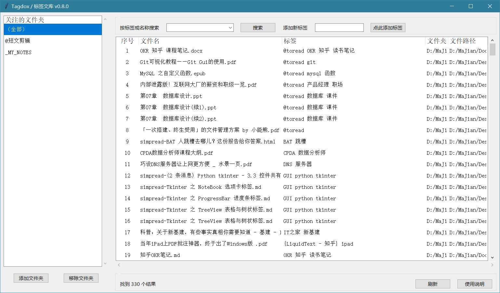

# Tagdox / 标签文库

## 介绍

「Tagdox/ 标签文库」是用于对文档进行「标签化管理」的免费开源工具。通过Python语言编写。

通过对文件（格式不限）按规则重命名，以#号（可自定义）对标签进行分割，并将标签提取出来，作为文件搜索的标记。

可实现对大量文件的标签化快速管理，熟悉后可显著提升效率。

## 主要功能

#### 以标签的方式，高效管理文件

对指定文件夹内部所有文件（包括子目录的文件）进行标签化管理。

可以自动识别标签。

文件的标签以文件名中的 # 号作为标签分隔符，自动分段提取。

例如，「某某通知#通知#会议记录#发布.pdf」会识别为 「某某通知.pdf 」+ 「标签：通知、会议记录、发布」

补充：

为了方便批量管理，对于文件名包括#号的，也会识别为标签。所以，如果有些文件拥有相同的主题（公共标签），可以直接放在叫做「#主题名称」的文件夹内，程序会自动识别为批量标签，为文件夹里面所有项都添加这个标签，而无需重命名。

识别为标签的文件夹层数默认为「最后2层」，层数可以自定义。

#### 按照标签快速查询文件

支持按照标签对文件进行筛选和检索。

当前文件夹的标签会自动生成到标签列表中，便于搜索。

也可以通过手动输入文件名和路径等任意关键词进行搜索。

#### 以重命名的方式，为文件添加标签，或者删除标签。

可以通过标签输入框，为指定的文件快速添加标签。

标签将通过 # 号分隔（符号可自定义），以重命名的方式添加到文件名中。

*注意：如果文件名不可随意修改，则禁止采用本方法。尤其是系统文件！*

## 软件架构

本程序采用Python实现，程序界面通过tkinter实现自动生成。

通过pyinstaller转制为exe可执行程序。

其中，标签文库.py 文件是全部的源代码，options.json是设置项。

## 安装教程

将dist文件复制到本地，运行其中的「标签文库.exe」即可。

其中json文件可以自定义参数，以后会开发可视化调整参数的功能。

#### 特例：解决外观模糊问题

代码已经为高分屏会出现的模糊做了特殊适配。

但，如果仍然存在模糊，可以尝试按照如下方式解决：

右击，属性 - 兼容性标签页 - 更改高DPI设置，在下面“替代高DPI缩放行为”处打钩，确定即可。

## 更新说明

#### v0.9.5.0 2021年7月4日

增加进度条显示；优化加载效率；优化排序加载算法，缩短排序时间。

#### v0.9.4.1 2021年7月4日

增加文件加载状态的提示，优化加载时间长期间的体验；

增加开发和实际数据的区分。

#### v0.9.4.0 2021年7月2日

新增：

- 增加了右键删除标签的功能；
- 增加了右键快速添加标签的功能。

优化：

- 切换文件夹之后会将滚动条设置到最顶部。
- 点击文件夹之后，如果并没有切换，就不执行文件夹内容刷新。

#### v0.9.3.3 2021年7月1日

修复了新建笔记定位错位的bug；增加文件列表中「在相同位置创建笔记」的功能。

#### v0.9.3.2 2021年7月1日

实现了对高分屏的适配，现在应该是默认就很清晰，不需要手动设置了。

#### v0.9.3.1 2021年6月30日

更新LOGO；

增加了切换文件夹之后是否清除筛选的变量；

完善了是否保留所有文件夹这个功能；

修复bug

#### v0.9.3 2021年6月30日

增加列表文件的高亮，包括添加标签后定位到相应位置、新建文件后定位到相应位置等。

#### v0.9.2 2021年6月29日

修复了可能导致空白文件夹的bug。

#### v0.9.0 2021年6月29日

实现了点击列标排序的功能。

#### v0.8.9 2021年6月29日

增加了右键菜单，实现跳转到文件夹等功能。

调整py文件名。

虽然重命名已完成，但不能输入特殊符号，所以暂不开放。

#### v0.8.2 2021年6月29日

升级了搜索功能，标签是直接选择，文字是直接输入，而且支持空格拆分多个输入文本片段。

调整UI，将新增标签输入框放在下面，更符合逻辑。

新增标签可以直接选择已有的标签。

默认以最大化方式启动。

增加对word缓存文档的屏蔽。

修复了一个启动时候不能刷新的bug。

#### v0.8.0 2021年6月27日

关注的文件夹列表终于完成了自定义！现在可以通过下面的增删按钮调整关注的文件夹列表，甚至可以直接鼠标拖动文件夹到文件夹列表区域，程序会自动识别并添加文件夹。

在没有设置项的时候，程序会自动创建初始化的设置文件。

优化内部逻辑，修复文件夹和文件夹简称可能重复的漏洞。

#### v0.7.0 2021年6月26日

更名为 Tagdox / 标签文库；

更新icon；

调整架构，将文件夹列表调整到左侧作为独立区间，并为以后增加子文件夹做准备；

列表增加序号列。

#### v0.6.4 2021年6月24日

优化文件夹路径简写功能，做到了 json 里面，更加规范，并且兼容了不带简写的写法。

列表按回车也能打开文件，而不仅仅是双击。

#### v0.6.3 2021年6月22日

为文件夹筛选增加了路径简写功能，简化下拉列表的显示效果，功能已经实现，但是还不够优雅。

准备做到 json 里面提供自定义功能。

而且现在这种方式存在最后文件夹名称重复的 bug ，也需要处理好。

#### v0.6.2 2021年6月22日

增加按文件夹筛选的功能。优化UI布局。

#### v0.6.1 2021年6月22日

增加排除文件夹的功能，目前包括以下规则：

- 路径中存在"."开头的文件夹
- 内容包括”_nomedia“文件
- 指定的排除文件夹名称（尚未实现自定义，以后实现） 

#### v0.6.0 2021年6月21日

实现界面自适应调整尺寸，并增加横向滚动条功能。

优化UI。

#### v0.5.2 2021年6月20日

支持对最末2层文件夹名称进行解析，如果文件夹名称包括#号也可以解析为标签（层数默认2层、分隔号默认#号，都可以自定义）。

微调UI。

#### v0.5.1 2021年6月20日

将分隔符（原来的#号）独立出来，设置为可以调整的符号。

在data.json里面可以设置。

#### v0.5.0  2021年6月19日

实现添加标签、自由搜索、结果计数的功能。

#### v0.4.0  2021年6月18日

实现按照中文音序排序标签。

将检索目录的设定方案调整到外接 json 文件中，实现程序外自定义。

优化UI、优化程序架构。

#### v0.1.0  2021年6月17日

实现文件检索、标签拆分等基础功能。

## 未来预计增加的功能

（ ）增加更多的设置项；

（ ）完整的「关于」窗口；

（ ）居中的输入框；

（√）删除标签

（√）点击行标排序

（√）跳转到目录

（√）指定扫描的排除文件夹

（√）行内编辑，免刷新和跳转（提高运行效率）

（√）搜索框去除前后空格

