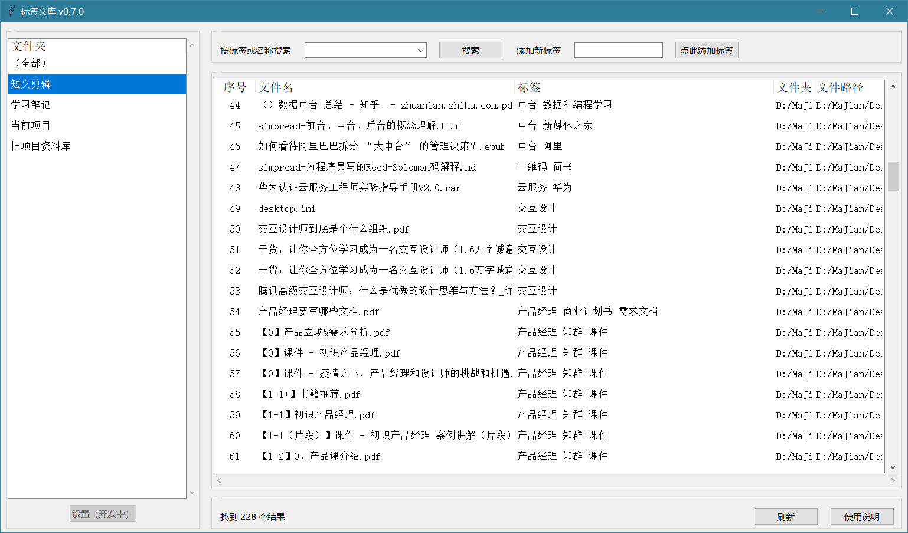
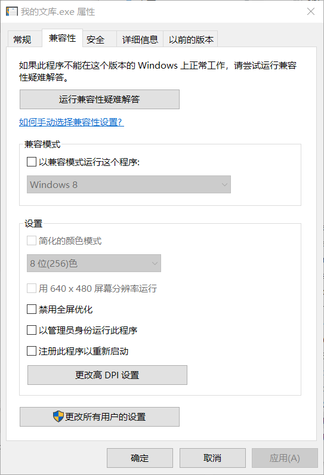
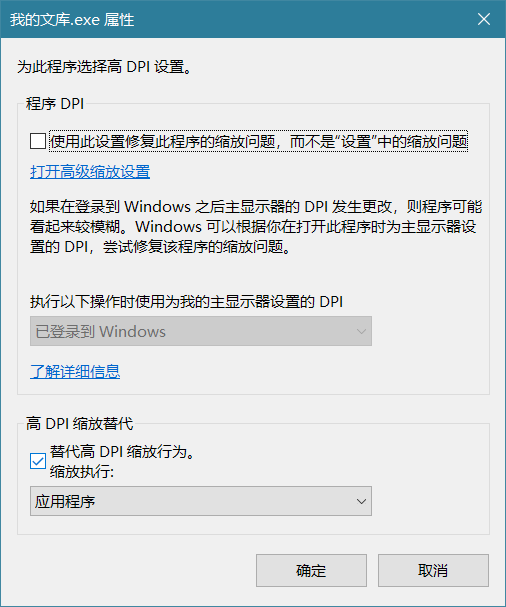

# Taglib / 标签文库

## 介绍

「Taglib / 标签文库」是用于对文档进行「标签化管理」的免费开源工具。通过Python语言编写。

通过对文件（格式不限）按规则重命名，以#号（可自定义）对标签进行分割，并将标签提取出来，作为文件搜索的标记。

可实现对大量文件的标签化快速管理，熟悉后可显著提升效率。

## 主要功能

#### 文件的标签识别

对指定文件夹内部所有文件（包括子目录的文件）进行汇集，并以 # 号作为标签分隔符，对所有文件进行标签化管理。

例如，「某某通知#通知#会议记录#发布.pdf」会识别为 「某某通知.pdf 」+ 「标签：通知、会议记录、发布」

对于文件名包括#号的，也会识别为标签。所以如果有些文件拥有相同的主题，可以直接放在叫做「#主体名称」文件夹内，会自动识别为批量标签。识别为标签的文件夹层数默认为「最后2层」，可自定义。

#### 添加标签

通过标签输入框，可以为指定的文件快速添加标签。标签将通过 # 号分隔（符号可自定义）。

标签将以重命名的方式添加到文件名中。

*注意：如果文件名不可随意修改，则不建议采用本方法。*

#### 文件查询

最大特色是支持按照标签对文件进行筛选和检索，标签从文件名中自动提取出来，并排序作为可选项。

也可以通过文件名和路径等任意关键词进行搜索。

## 软件架构

本程序采用Python实现，程序界面通过tkinter实现自动生成。

通过pyinstaller转制为exe可执行程序。

其中，我的文库.py 文件是全部的源代码。

## 安装教程

将dist文件复制到本地，运行其中的「我的文库.exe」即可。

其中json文件可以自定义参数，以后会开发可视化调整参数的功能。

#### 解决外观模糊问题：

部分高分屏会出现模糊，可以通过右击 - 属性 - 兼容性标签页 - 更改高DPI设置

然后在下面“替代高DPI缩放行为”处打钩，确定即可。

## 更新说明

#### v0.7.0 2021年6月26日

更名为“标签文库”；

更新icon；

调整架构，将文件夹列表调整到左侧作为独立区间，并为以后增加子文件夹做准备；

列表增加序号列。

#### v0.6.4 2021年6月24日

优化文件夹路径简写功能，做到了 json 里面，更加规范，并且兼容了不带简写的写法。

列表按回车也能打开文件，而不仅仅是双击。

#### v0.6.3 2021年6月22日

为文件夹筛选增加了路径简写功能，简化下拉列表的显示效果，功能已经实现，但是还不够优雅。

准备做到 json 里面提供自定义功能。

而且现在这种方式存在最后文件夹名称重复的 bug ，也需要处理好。

#### v0.6.2 2021年6月22日

增加按文件夹筛选的功能。优化UI布局。

#### v0.6.1 2021年6月22日

增加排除文件夹的功能，目前包括以下规则：

- 路径中存在"."开头的文件夹
- 内容包括”_nomedia“文件
- 指定的排除文件夹名称（尚未实现自定义，以后实现） 

#### v0.6.0 2021年6月21日

实现界面自适应调整尺寸，并增加横向滚动条功能。

优化UI。

#### v0.5.2 2021年6月20日

支持对最末2层文件夹名称进行解析，如果文件夹名称包括#号也可以解析为标签（层数默认2层、分隔号默认#号，都可以自定义）。

微调UI。

#### v0.5.1 2021年6月20日

将分隔符（原来的#号）独立出来，设置为可以调整的符号。

在data.json里面可以设置。

#### v0.5.0  2021年6月19日

实现添加标签、自由搜索、结果计数的功能。

#### v0.4.0  2021年6月18日

实现按照中文音序排序标签。

将检索目录的设定方案调整到外接 json 文件中，实现程序外自定义。

优化UI、优化程序架构。

#### v0.1.0  2021年6月17日

实现文件检索、标签拆分等基础功能。

## 未来预计增加的功能

可视化设置json配置文件；

点击行标排序

删除标签

跳转到目录

指定扫描的排除文件夹

行内编辑，免刷新和跳转（提高运行效率）

搜索框去除前后空格

