

        
    <h1>
        Tagdox - 标签文库
    </h1>
    
    
    <!-- Short description: -->
  
Powered by Python and Tkinter

## 简要介绍

Tagdox / 标签文库，是用于对文档进行「标签化管理」的免费开源工具。通过Python语言编写。

利用Windows系统NTFS文件流的特性，为文件加标签，并可实现标签的识别和查询等功能。

可实现对大量文件的标签化快速管理，可显著提升效率。

2023年9月28日备注：

近期正在调整软件架构，包括代码拆分以及不合理的命名调整等。

## 程序界面

以 v0.20.3.3为例（此为**旧版页面**，请以最新版本为准，详见更新记录）。

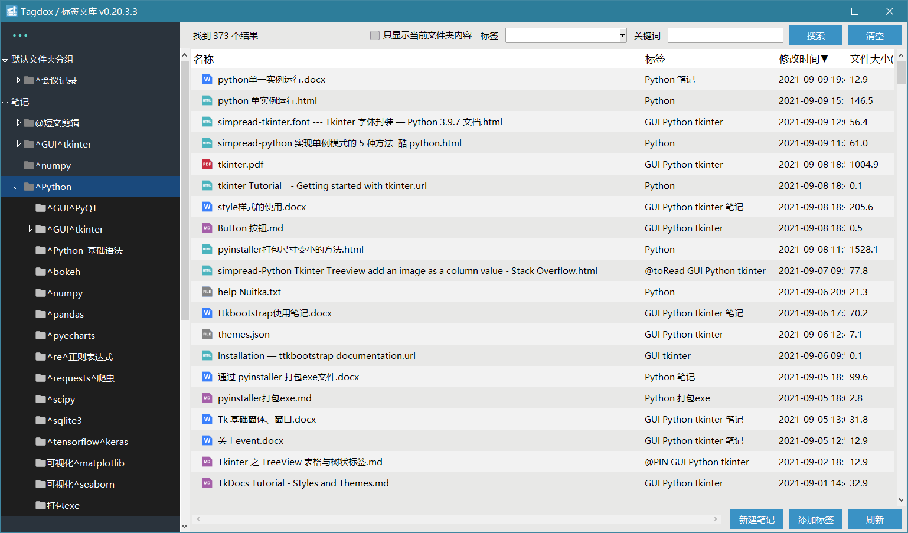

其中：

左侧是关注的文件夹，可以将文件夹添加到这里，程序将自动对其中所有文件进行解析。支持分组管理。

右侧是文件列表，左起第二列就是本程序最核心的「标签」部分。

## 开发说明

本程序采用Python实现，程序界面主要依靠tkinter库完成开发。

通过pyinstaller转制为exe可执行程序，所以目前只支持 windows 系统。

程序完全开源，不上传任何数据。

其中，标签文库.py 文件是全部的源代码，options_for_tagdox.json是设置项，没有设置项时程序会自动生成。

## 主要功能

### 文件和标签管理

#### 为文件添加 / 删除标签。

可以为指定的文件快速添加标签，快捷键是 Ctrl+T。支持多文件批量操作。

添加标签的方式：

（1）右键，添加标签。

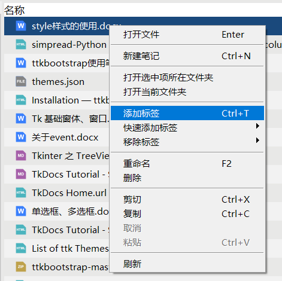

（2）点击右下角按钮添加。

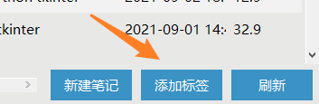

（3）快捷键Ctrl+T添加。

当然，删除标签也是一键搞定。

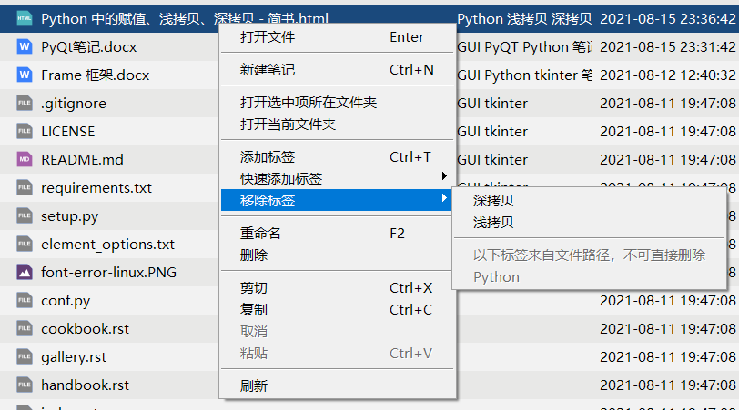

##### 补充：识别文件夹标签

（备注：本功能即将被移除或重做）

对于文件名包括标签识别符的，也会识别为标签。可以方便地进行大批量快速管理。

如果有些文件拥有相同的主题（公共标签），可以直接放在叫做「文件夹名称^标签名称」的文件夹内，程序会自动将「标签名称」识别为批量标签，为文件夹里面所有项都添加这个标签，而无需对每个文件进行重命名操作。

文件夹批量标签的识别层数可以通过设置进行自定义。

#### 按照标签快速查询文件

支持按照标签对文件进行筛选和检索。

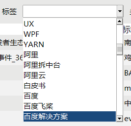

当前文件夹的标签会自动提取到标签列表中，便于按标签快速搜索。

也可以通过手动输入文件名和路径等任意关键词进行搜索。

#### 拖拽添加文件/文件夹

可以通过鼠标将任意文件或文件夹拖拽到右侧文件列表，被拖动的文件/文件夹将被移动（或复制）到当前打开的文件夹中。

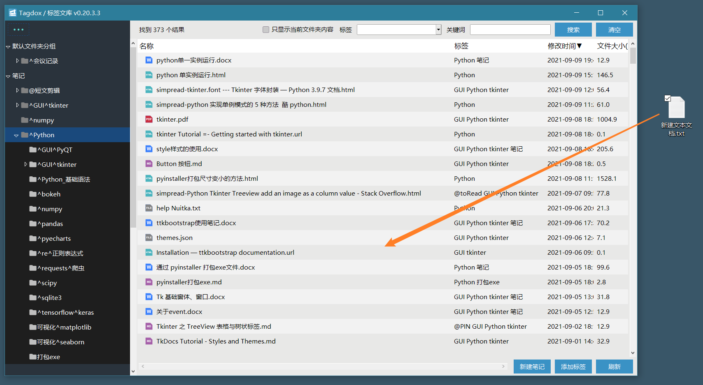

可以通过菜单设置项，设置拖拽操作是「移动」（不保留原始文件）还是「复制」。

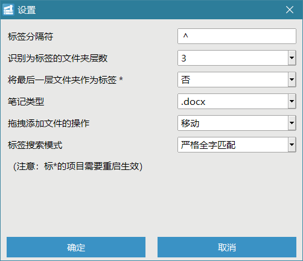

添加文件时，会自动为文件附带当前选中的标签。

这个功能非常适合管理微信的文件，从聊天列表中一拖拽就能保存到目标位置，而且可以快速添加标签，让管理更加轻松。

### 文件夹管理

#### 添加关注的文件夹

本程序主要分析目标是本机文件夹。

对任意文件夹添加关注之后，文件夹将出现在本程序左侧列表中，添加之后才能进行文件分析和管理操作。

添加的方式：

（1）可以通过点击顶部菜单按钮添加，

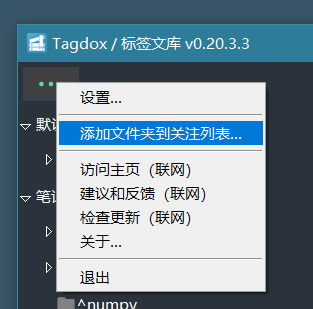

（2）也可以直接将文件夹用鼠标拖动到列表区域，支持多文件夹拖动操作；

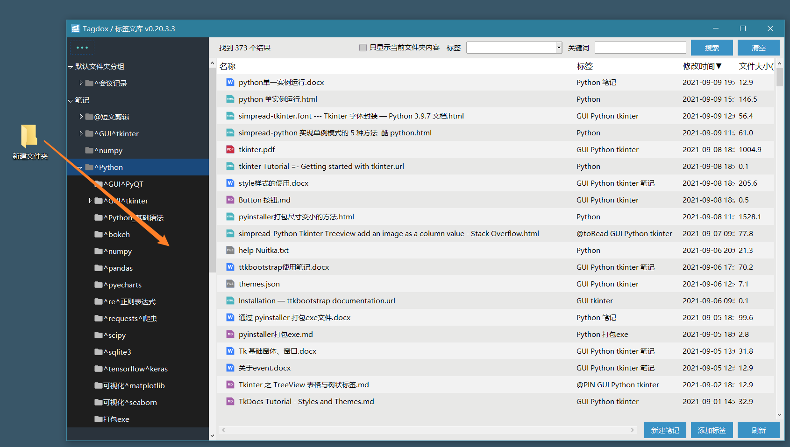

（3）还可以通过右键菜单，将子文件夹快速添加到关注列表。

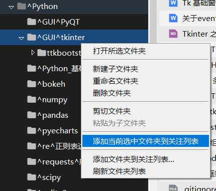

#### 文件夹分组

可以通过**文件夹分组**，对相似功能的文件夹进行统一管理，比如查询搜索或者标签管理等。

如下图所示：

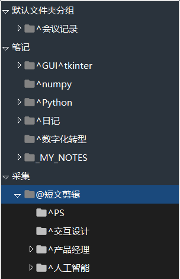

分组可以通过右键菜单自定义。

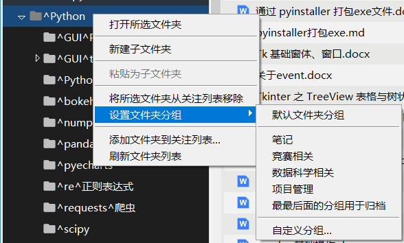

### 更多功能

#### 快速笔记

程序可以快速添加笔记，并以本地文件的方式实现笔记管理，

添加这个功能的主要原因是已经受够了在线笔记软件（如印X笔记、为X笔记、有X云笔记等）越来越差的使用体验，以及越来越麻烦的数据垄断。

笔记还是要掌握在用户自己手中！所以，这里的笔记坚决以本地文件的方式实现，完全自主可控。

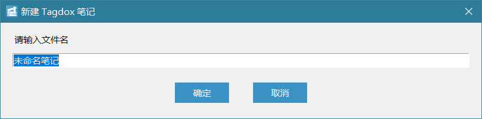

可以通过设置，选择笔记类型为 docx、md、rtf、txt等。

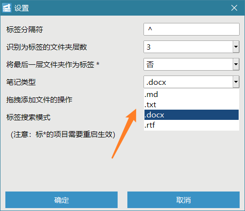

新建笔记之后将首先输入名称，然后立刻自动打开笔记。

## 安装教程

请访问「[发行版](https://gitee.com/horse_sword/my-local-library/releases)」页面，下载最新版本并解压缩，运行其中的「标签文库.exe」文件即可。

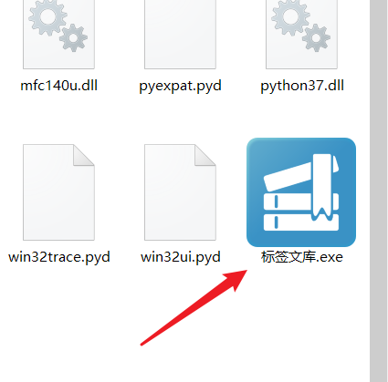

版本升级：

目前还没有制作专门的安装包，所以将最新版压缩包下载后，解压缩，直接覆盖旧版文件夹即可。

## 感谢

感谢以下朋友的技术支持

[**GoogleLLP** Xiangrui Zong](https://github.com/GoogleLLP)

## 更新记录

#### v0.25.1.8 2023年9月27日
修正了空格唤起的文件预览框缩放不正确的问题。
将图标等素材统一移动到 resources 文件夹下。

（近期正在调整软件架构）

#### v0.25.1.7 2023年7月25日
将左侧列表的缩进设置为40，提高区分度。之后考虑做成自适应或者可调节的。

 #### v0.25.1.6 2023年1月24日

 补充了弹窗对高分屏的适配。

#### v0.25.1.5 2023年1月22日
增加了对1080p以上分辨率的缩放适配.

#### v0.25.1.4 2022年10月15日

fixed:  修复了点击分组（0级目录）的时候，不能查看分组文件的bug（#I5VX6P）。
优化文件夹取消关注的表达。

#### v0.25.1.3 2022年10月13日

优化了点击左侧文件夹的时候，增加了对当前文件夹的刷新的逻辑。
之前启动的时候，文件夹是完整加载，效率太低。现在优化为只加载一层子文件夹，加载速度显著提升。

#### v0.25.1.2 2022年8月15日

增加标签页拖拽为剪切移动的功能；调整标签为左对齐。

#### v0.25.1.1 2022年7月20日

优化询问拖拽是否保留原始文件的表达。

#### v0.25.1.0 2022年7月5日

外部文件拖拽进入主窗口时，可以通过对话框设定是否保留原始文件。

#### v0.25.0.1 2022年5月22日

修复了文件夹区域左键单击时，当前对象没有正常高亮的bug。

#### v0.25.0.0 2022年5月22日

左侧文件夹列表优化，现在右键操作可直接作用于鼠标选中对象，而不是只能操作打开的文件夹。

#### v0.24.0.0 2022年5月5日

调整UI显示，将标签、日期、大小都放在右侧。

#### v0.23.1.2 2022年4月30日

修复了文件夹名称存在包含关系时，较长文件夹的内部文件会出现在较短文件夹内部的bug。

#### v0.23.1.1 2022年3月9日

修复了点击列表空白处的bug。

#### v0.23.1.0 2022年3月8日

实现了隐藏空分组的功能。
已知bug：按住Ctrl的时候，点击分组内的项目，不能选中。

#### v0.23.0.3 2022年3月7日

尝试修复了tree定位高亮项目的错误。

#### v0.23.0.2 2022年3月5日

尝试修复输入框与中文输入法之间的兼容性问题。

#### v0.23.0.1 2022年3月5日

实现了按照子文件夹分组显示的功能，
修复了文件夹分组的背景色问题；
已知bug：tree定位到高亮内容存在错误。

#### v0.23.0.0 2022年3月3日

增加tree分组显示，可以将子文件夹的内容在第二组显示出来，
相关的功能还没有全部测试。
已知bug：tree定位到高亮内容存在错误。
tree列表的背景色有错误；
如果能显示文件夹名称就更好了。

#### v0.22.1.0 2022年1月12日

增加.git文件夹的忽略；
将默认配置文件配置设定在上级目录。

#### v0.22.0.4 2022年1月12日

优化了新建笔记时候的扩展名提示。

#### v0.22.0.3 2022年1月3日

对部分函数进行了重命名，逻辑没有改。

## 2021年12月

#### v0.22.0.2 2021年12月25日

文件重命名默认不再修改扩展名，避免重命名导致的其他问题。
圣诞快乐！

#### v0.22.0.1 2021年12月21日

优化文件夹排序，实现英文首字母混排，且忽略标签分隔符。
精简部分菜单项。

#### v0.22.0.0 2021年12月19日

优化了标签区域的鼠标效果；
为子窗口增加后台自动关闭的功能，修复了在后台会锁住程序的bug。

#### v0.21.4.6 2021年12月19日

修复了短时间快速点击可能导致多次打开文件的bug。

#### v0.21.4.5 2021年12月19日

将文件夹区域右键的添加关注文件夹功能调整到菜单中。

#### v0.21.4.4 2021年12月2日

优化代码，将标签的排除类型调整到变量中。

#### v0.21.4.3 2021年12月2日

隐藏了标签下拉框。

## 2021年11月

## 

#### v0.21.4.2 2021年11月28日

尝试修复Typora以覆盖方式更新md文件导致丢失标签的bug。

#### v0.21.4.1 2021年11月26日

优化UI布局和颜色。

#### v0.21.4.0 2021年11月26日

增加标签列表，提高标签应用性能，进入测试阶段。

#### v0.21.3.1 2021年11月17日

优化体验，当左键单击列表空白的时候，会自动取消选中。

## 2021年10月

#### v0.21.3.0 2021年10月30日

增加对markdown移动的优化，相对路径附件可以在移动的时候自动复制了，
这样移动后的md文件仍然可以正常访问图片等附件。

#### v0.21.2.0 2021年10月21日

右键新建笔记的时候，可以更方便地选择笔记类型了。

#### v0.21.1.2 2021年10月6日

修复了在非NTFS磁盘上的兼容性bug。
文件夹区域也增加了鼠标指向效果。
修改自建模块位置。

#### v0.21.1.1 2021年10月4日

储备：优化标签类封装逻辑，关闭文件前一直占用文件。
储备：新增常用工具函数，直接对标签进行增加、删除、清空、查询。
储备：新增依赖说明requirements.txt。

#### v0.21.1.0 2021年10月4日

为文件列表的鼠标指向增加了高亮效果。

#### v0.21.0.0 2021年10月3日

优化标签逻辑，采用NTFS流模式，不再影响文件名（测试版）。
优化右键响应，现在可以正确在被点击的项目处出现右键菜单了。

## 2021年9月

#### v0.20.3.7 2021年9月18日

优化了分组的颜色，调整为浅蓝色；调整菜单按钮颜色为浅蓝色。

#### v0.20.3.6 2021年9月15日

修复新建笔记时错误影响存储的笔记类型的bug。

#### v0.20.3.5 2021年9月13日

开放“打开文件夹并选中文件”的功能。

#### v0.20.3.4 2021年9月12日

增加只筛选笔记的功能；增加部分快捷键；增加窗口最小尺寸限制。

#### v0.20.3.3 2021年9月10日

增加空格查看文件信息的功能；增加Insert键快速插入txt笔记的功能。

#### v0.20.3.2 2021年9月9日

修复：复制粘贴快捷键在输入弹窗中与输入框冲突的问题。

#### v0.20.3.1 2021年9月9日

优化界面布局和间距，调整按钮等。

#### v0.20.3.0 2021年9月6日

优化界面。

#### v0.20.2.0 2021年9月6日

文件列表增加常用的小图标。

#### v0.20.1.1 2021年9月6日

修复文件夹重复添加的bug，增加快速添加子目录到关注列表的功能。

#### v0.20.1.0 2021年9月6日

全面优化界面UI和配色。

#### v0.20.0.0 2021年9月6日

重大更新：
美化UI，增加主题配色。

#### v0.19.1.0 2021年9月6日

允许拖拽文件夹到主窗口；修复文件夹列表可能被多选的bug。

#### v0.19.0.5 2021年9月5日

代码拆分成多个文件，首先拆分进度条和弹窗类。

#### v0.19.0.4 2021年9月5日

修复初始化时定位文件夹错误的bug。

#### v0.19.0.3 2021年9月5日

修复文件夹刷新后的定位异常。

#### v0.19.0.2 2021年9月4日

修复文件拖拽到分组的异常。

#### v0.19.0.1 2021年9月4日

优化文件夹分组，增加置顶分组功能。

#### v0.19.0.0 2021年9月4日

重大更新：
实现文件夹分组等功能；
文件夹按照名称排序；
移除文件夹顺序自定义功能。

#### v0.18.6.3 2021年9月4日

优化剪切逻辑，统一部分函数命名规则。

#### v0.18.6.2 2021年9月3日

子文件夹删除或移动时，取消文件的粘贴功能。

#### v0.18.6.1 2021年9月3日

增加子文件夹删除的功能。

#### v0.18.6.0 2021年9月3日

增加子文件夹移动的功能；增加检查更新的功能。

#### v0.18.5.0 2021年9月3日

将删除修改为删除到回收站。

#### v0.18.4.1 2021年9月2日

实现了文件的复制剪切功能。

#### v0.18.4.0 2021年9月2日

刷新文件夹列表时，选中项保留在之前位置附近；
增加重命名文件夹功能。

#### v0.18.3.4 2021年9月1日

调整表格的列宽度。

## 2021年8月

#### v0.18.3.3 2021年8月25日

将删除修改为隐藏。

#### v0.18.3.2 2021年8月23日

增加「新建子文件夹」功能。

#### v0.18.3.1 2021年8月23日

强化「拿起」之后的视觉效果。

#### v0.18.3.0 2021年8月23日

增加「拿起放下」功能，算是程序内的剪切粘贴。

#### v0.18.2.0 2021年8月23日

增加只看当前文件夹的功能。

#### v0.18.1.2 2021年8月22日

添加点击文件夹时，同级文件夹自动折叠的效果。

#### v0.18.1.1 2021年8月21日

文件夹设置为随点随开，并优化了文件夹排序时的定位效果。

#### v0.18.1.0 2021年8月21日

增加0级、1级、2级文件夹在点击时自动展开/折叠的功能。

#### v0.18.0.0 2021年8月21日

将左侧文件夹列表调整为树结构。取消子文件夹模式。

#### v0.17.0.3 2021年8月17日

修复点击全部文件夹之后，再点击第一个文件夹会导致看不到子文件夹的bug。

#### v0.17.0.2 2021年8月17日

将功能绑定拆分到类的独立函数，进一步解耦；稍微优化设置窗口的界面布局。

#### v0.17.0.1 2021年8月17日

修复了新建笔记的默认名称可能会保留上一个笔记名称的bug。

#### v0.17.0.0 2021年8月16日

以独立class的方式重构主页面架构【重要更新】。

#### v0.16.1.1 2021年8月15日

更新了关于页面的二维码。

#### v0.16.1.0 2021年8月13日

设置项增加对最后目录的解析设置、对标签的解析设置。

#### v0.16.0.1 2021年8月13日

优化最后一级目录作为标签对空格的解析。

#### v0.16.0.0 2021年8月12日

启动时增加后台进程，显著提高数据加载速度。

#### v0.15.2.5 2021年8月12日

优化部分UI显示。

#### v0.15.2.4 2021年8月12日

优化部分UI显示，增加框架底纹。

#### v0.15.2.3 2021年8月11日

优化部分界面显示。

#### v0.15.2.2 2021年8月9日

修复单击相同的主文件夹会导致子文件夹消失的bug。

#### v0.15.2.1 2021年8月9日

优化排序逻辑，现在大小写放在一起排序。

#### v0.15.2.0 2021年8月9日

将窗口模式的添加到设置项中。

#### v0.15.1.2 2021年8月8日

修复子文件夹重命名和新建的bug。

#### v0.15.1.1 2021年8月7日

修复子文件夹模式的标签刷新逻辑bug。

#### v0.15.1.0 2021年8月7日

采用字典查询，显著增加列表加载速度。

#### v0.15.0.4 2021年8月6日

增加对文件创建时间的解析，但是还没开放。

#### v0.15.0.3 2021年8月3日

增加标签「强筛选」和「弱筛选」的功能。默认是弱筛选。

#### v0.15.0.2 2021年8月3日

增加文件夹列表“置顶”的功能。

#### v0.15.0.1 2021年8月2日

标签区域排序优化，现在无论大小写英文都可以在一起排序了。

#### v0.15.0.0 2021年8月1日

实现左下角列表区域为标签功能的调试，好像可以正常使用。进入测试阶段。

### 2021年7月

#### v0.14.3.1 2021年7月31日

增加文件列表区拖拽进来的自动添加当前选中标签的功能，为标签化管理做好准备。

#### v0.14.3.0 2021年7月31日

增加将最后的子文件夹也作为标签的功能。

#### v0.14.2.6 2021年7月31日

子文件夹区域新增「新建文件夹」和「重命名文件夹」功能。

#### v0.14.2.5 2021年7月30日

将搜索项目分类处理，并将关键词搜索限制在文件名和标签范围内；增加文件夹列表对键盘上下键的响应。
已知bug：快速按上下键会导致进度条不消失。所以现在增加了点击进度条使其强行消失的功能。

#### v0.14.2.4 2021年7月28日

文件区右键菜单将不可执行的功能也显示出来并标记为灰色。

#### v0.14.2.3 2021年7月28日

增加对多文件拖拽添加的视觉支持；多个关键词的搜索逻辑现在是“and”关系。

#### v0.14.2.2 2021年7月27日

增加对多文件同时删除公共标签。

#### v0.14.2.1 2021年7月27日

增加对多文件同时操作的支持，而且可以快速选中多个处理结果。

#### v0.14.2.0 2021年7月27日

增加对多文件同时操作的支持，目前支持同时打开、同时增加标签，但是加标签的选中体验还不好。

#### v0.14.1.4 2021年7月27日

增加 Ctrl+F 出现弹窗快捷搜索的功能；调整弹窗位置为窗口中央而不是屏幕中央。

#### v0.14.1.3 2021年7月24日

增加按F5刷新的快捷键。

#### v0.14.1.2 2021年7月24日

修复了文件夹为空时刷新会导致卡死的bug。

#### v0.14.1.1 2021年7月23日

优化字体和字号显示；简化笔记标签显示方式。

#### v0.14.1.0 2021年7月22日

增加了文件夹拖动进来是移动还是复制的设置；优化设置文件的架构。

#### v0.14.0.5 2021年7月22日

按照规则优化了代码里面函数的名称，对功能没有变化。

#### v0.14.0.4 2021年7月19日

增加子文件夹区域快速添加关注的功能。

#### v0.14.0.3 2021年7月19日

增加子文件夹区域的右键菜单。

#### v0.14.0.2 2021年7月18日

修复进度条显示错误。

#### v0.14.0.1 2021年7月18日

切换文件夹时不再保留标签搜索项。

#### v0.14.0.0 2021年7月17日

将子文件夹独立为左侧列表。

#### v0.13.1.0 2021年7月16日

去掉文件夹区域下面的按钮框架。

#### v0.13.0.5 2021年7月16日

修复设置项修改后不能立刻刷新的bug；修复输入框二次刷新的bug；优化部分菜单。

#### v0.13.0.4 2021年7月15日

修复分辨率和缩放不兼容导致的启动失败问题。

#### v0.13.0.3 2021年7月14日

修复致命bug。

#### v0.13.0.2 2021年7月13日

修正了一处错别字。

#### v0.13.0.1 2021年7月12日

多进程性能太差，所以修改为多线程逻辑。

#### v0.13.0.0 2021年7月10日

加入多进程并发处理逻辑。

#### v0.12.2.0 2021年7月10日

优化代码架构。

#### v0.12.1.0 2021年7月9日

增加了文件大小数据。

#### v0.12.0.2 2021年7月9日

修复了输入框覆盖的错误。

#### v0.12.0.1 2021年7月9日

修复了提示文字的错误。

#### v0.12.0.0 2021年7月9日

增加了居中的进度条。

#### v0.11.2.4 2021年7月8日

Bug修复，性能优化。

#### v0.11.2.3 2021年7月8日

逻辑优化。

#### v0.11.2.2 2021年7月8日

修复子文件夹手动留空时候，标签列表错误的bug。

#### v0.11.2.1 2021年7月8日

优化弹窗代码逻辑；修复 ALL_FOLDERS=2 的时候取消关注文件夹的按钮失效的bug；

#### v0.11.2.0 2021年7月8日

增加列排序的可视化提示效果；优化标签的添加逻辑。

#### v0.11.1.0 2021年7月8日

优化了窗口的左上角图标。

#### v0.11.0.0 2021年7月7日

完成了自制的居中输入窗体，并优化了界面；
解决了分辨率导致的窗口位置偏移问题。

#### v0.10.2.3 2021年7月7日

修复了GBK不支持特殊空格，导致排序失败的问题。

#### v0.10.2.2 2021年7月7日

将设置窗口和关于窗口调整为模态。

#### v0.10.2.1 2021年7月7日

修复了切换文件夹的bug。

#### v0.10.2.0 2021年7月7日

实现文件列表上下移动的功能。

#### v0.10.1.0 2021年7月7日

实现文件列表的重命名和删除功能。

#### v0.10.0.4 2021年7月7日

修复了子文件夹内添加或删除标签的定位逻辑；优化通过菜单添加标签的交互。

#### v0.10.0.3 2021年7月6日

修复列表的中文排序；优化列表文件定位逻辑。

#### v0.10.0.2 2021年7月6日

修复列表文件定位错误的bug。

#### v0.10.0.1 2021年7月6日

优化设置弹窗显示。

#### v0.10.0.0 2021年7月6日

增加了子文件夹的筛选功能，进一步提高管理效率。

#### v0.9.5.4 2021年7月5日

增加设置菜单；调整分隔符的潜在兼容性错误。

#### v0.9.5.3 2021年7月5日

增加「关于」窗口功能。

#### v0.9.5.2 2021年7月5日

增加主菜单功能。

#### v0.9.5.1 2021年7月5日

增加拖拽文件直接复制到文件夹内的功能，便于处理微信文件或其他需要复制的业务。

#### v0.9.5.0 2021年7月4日

增加进度条显示；优化加载效率；优化排序加载算法，缩短排序时间。

#### v0.9.4.1 2021年7月4日

增加文件加载状态的提示，优化加载时间长期间的体验；

增加开发和实际数据的区分。

#### v0.9.4.0 2021年7月2日

新增：

- 增加了右键删除标签的功能；
- 增加了右键快速添加标签的功能。

优化：

- 切换文件夹之后会将滚动条设置到最顶部。
- 点击文件夹之后，如果并没有切换，就不执行文件夹内容刷新。

#### v0.9.3.3 2021年7月1日

修复了新建笔记定位错位的bug；增加文件列表中「在相同位置创建笔记」的功能。

#### v0.9.3.2 2021年7月1日

实现了对高分屏的适配，现在应该是默认就很清晰，不需要手动设置了。

### 2021年6月

#### v0.9.3.1 2021年6月30日

更新LOGO；

增加了切换文件夹之后是否清除筛选的变量；

完善了是否保留所有文件夹这个功能；

修复bug

#### v0.9.3 2021年6月30日

增加列表文件的高亮，包括添加标签后定位到相应位置、新建文件后定位到相应位置等。

#### v0.9.2 2021年6月29日

修复了可能导致空白文件夹的bug。

#### v0.9.0 2021年6月29日

实现了点击列标排序的功能。

#### v0.8.9 2021年6月29日

增加了右键菜单，实现跳转到文件夹等功能。

调整py文件名。

虽然重命名已完成，但不能输入特殊符号，所以暂不开放。

#### v0.8.2 2021年6月29日

升级了搜索功能，标签是直接选择，文字是直接输入，而且支持空格拆分多个输入文本片段。

调整UI，将新增标签输入框放在下面，更符合逻辑。

新增标签可以直接选择已有的标签。

默认以最大化方式启动。

增加对word缓存文档的屏蔽。

修复了一个启动时候不能刷新的bug。

#### v0.8.0 2021年6月27日

关注的文件夹列表终于完成了自定义！现在可以通过下面的增删按钮调整关注的文件夹列表，甚至可以直接鼠标拖动文件夹到文件夹列表区域，程序会自动识别并添加文件夹。

在没有设置项的时候，程序会自动创建初始化的设置文件。

优化内部逻辑，修复文件夹和文件夹简称可能重复的漏洞。

#### v0.7.0 2021年6月26日

更名为 Tagdox / 标签文库；

更新icon；

调整架构，将文件夹列表调整到左侧作为独立区间，并为以后增加子文件夹做准备；

列表增加序号列。

#### v0.6.4 2021年6月24日

优化文件夹路径简写功能，做到了 json 里面，更加规范，并且兼容了不带简写的写法。

列表按回车也能打开文件，而不仅仅是双击。

#### v0.6.3 2021年6月22日

为文件夹筛选增加了路径简写功能，简化下拉列表的显示效果，功能已经实现，但是还不够优雅。

准备做到 json 里面提供自定义功能。

而且现在这种方式存在最后文件夹名称重复的 bug ，也需要处理好。

#### v0.6.2 2021年6月22日

增加按文件夹筛选的功能。优化UI布局。

#### v0.6.1 2021年6月22日

增加排除文件夹的功能，目前包括以下规则：

- 路径中存在"."开头的文件夹
- 内容包括”_nomedia“文件
- 指定的排除文件夹名称（尚未实现自定义，以后实现） 

#### v0.6.0 2021年6月21日

实现界面自适应调整尺寸，并增加横向滚动条功能。

优化UI。

#### v0.5.2 2021年6月20日

支持对最末2层文件夹名称进行解析，如果文件夹名称包括#号也可以解析为标签（层数默认2层、分隔号默认#号，都可以自定义）。

微调UI。

#### v0.5.1 2021年6月20日

将分隔符（原来的#号）独立出来，设置为可以调整的符号。

在data.json里面可以设置。

#### v0.5.0  2021年6月19日

实现添加标签、自由搜索、结果计数的功能。

#### v0.4.0  2021年6月18日

实现按照中文音序排序标签。

将检索目录的设定方案调整到外接 json 文件中，实现程序外自定义。

优化UI、优化程序架构。

（中间开发版未记录）

#### v0.1.0  2021年6月17日

实现文件检索、标签拆分等基础功能。

