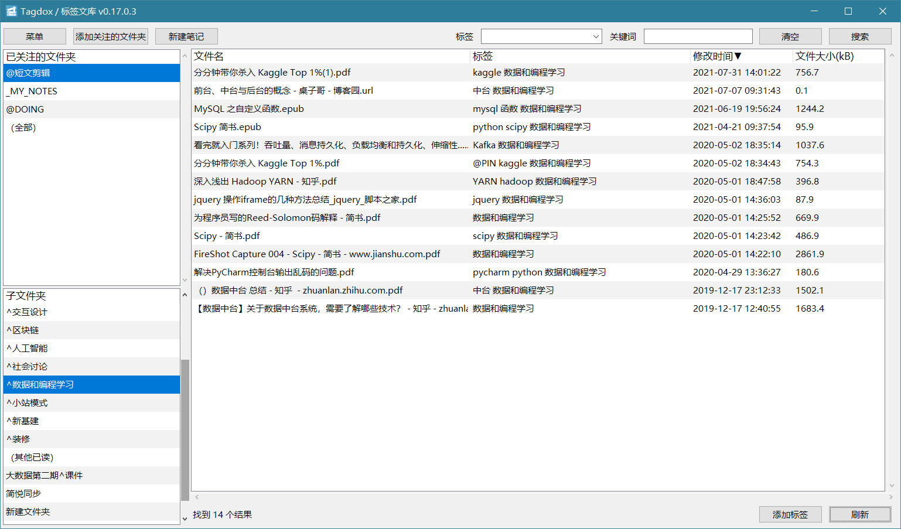

# Tagdox / 标签文库

## 简要介绍

Tagdox / 标签文库，是用于对文档进行「标签化管理」的免费开源工具。通过Python语言编写。

通过对文件重命名的方式，以^号（默认值，可修改）将标签直接标记在文件名中，并可实现标签的识别和查询等功能。

可实现对大量文件的标签化快速管理，可显著提升效率。

#### 程序界面

以 v0.17.0.3 为例。

其中，左上角是关注的文件夹，可以将文件夹添加到这里，程序将自动对其中所有文件进行解析。

左下角是子文件夹列表。

右侧是解析结果，注意其中第二列就是本程序最核心的「标签」部分。

## 主要功能

#### 以重命名的方式，为文件添加 / 删除标签。

可以为指定的文件快速添加标签，快捷键是 Ctrl+T。

支持多文件批量操作。

标签将通过 ^ 号（可自定义）分隔，以重命名的方式添加到文件名中。

当然，删除标签也是一键搞定。

> 举例：「某某通知.pdf」加入标签“标签1”、“标签2”之后，文件名将变为「某某通知\^标签1\^标签2.pdf」。
>
> 在程序内会分开显示，解析为「某某通知.pdf」和 “标签1”、“标签2”。
>
> 注意：如果文件名不适合修改，则**禁止**采用本程序进行增删标签操作。**尤其是系统文件**！改文件名导致的各种损失，本人概不负责哦。

#### 识别文件的标签

可以自动识别标签，对指定文件夹内部所有文件（包括子目录的文件）进行标签化管理。

识别方法1：以文件名中的 ^号作为标签分隔符，自动分段提取。

> 例如，「某某通知^ 通知 ^会议记录 ^发布.pdf」会识别为 「某某通知.pdf 」+ 「标签：通知、会议记录、发布」
>

##### 补充：识别文件夹标签

对于文件名包括标签识别符的，也会识别为标签。可以方便地进行大批量快速管理。

如果有些文件拥有相同的主题（公共标签），可以直接放在叫做「文件夹名称^标签名称」的文件夹内，程序会自动将「标签名称」识别为批量标签，为文件夹里面所有项都添加这个标签，而无需对每个文件进行重命名操作。

文件夹批量标签的识别层数可以通过设置进行自定义。

#### 按照标签快速查询文件

支持按照标签对文件进行筛选和检索。

当前文件夹的标签会自动提取到标签列表中，便于按标签快速搜索。

也可以通过手动输入文件名和路径等任意关键词进行搜索。

#### 添加关注的文件夹

对任意文件夹添加关注之后，文件夹将出现在本程序左侧列表中。

可以通过点击按钮添加，也可以直接将文件夹用鼠标拖动到列表区域。

支持多文件夹拖动操作。

#### 拖拽添加文件

右侧文件列表可以通过鼠标拖拽的方式，将文件添加到其中，文件将被拖拽到当前打开的文件夹中。

可以通过菜单设置项，设置拖拽操作是「移动（不保留原始文件）」还是「复制」。

添加文件时，会自动为文件附带当前选中的标签。

#### 添加笔记

程序实现了自动添加笔记，以本地文件的方式实现，

可以选择笔记类型为 docx、md、rtf、txt等。

新建笔记之后将首先输入名称，然后立刻自动打开笔记。

添加这个功能的主要原因是已经受够了在线笔记软件越来越差的使用体验和越来越麻烦的数据垄断。

笔记还是要掌握在用户自己手中！

所以，这里的笔记坚决以本地文件的方式实现，完全自主可控。

## 开发说明

本程序采用Python实现，程序界面主要依靠tkinter库完成开发。

通过pyinstaller转制为exe可执行程序，所以目前只支持 windows 系统。

其中，标签文库.py 文件是全部的源代码，options_for_tagdox.json是设置项，没有设置项时程序会自动生成。

## 安装教程

#### 方法（1）：

请访问「[发行版](https://gitee.com/horse_sword/my-local-library/releases)」并下载解压缩，运行其中的「标签文库.exe」文件即可。

#### 方法（2）：

将dist文件夹复制到本地，运行其中的「标签文库.exe」即可。

#### 备注：

代码已经为高分屏会出现的模糊做了特殊适配，按理说不应该存在模糊情况。

如果仍然存在模糊，可以尝试按照如下方式解决：

右击，属性 - 兼容性标签页 - 更改高DPI设置，在下面“替代高DPI缩放行为”处打钩，确定即可。

未发生模糊时请勿执行上述操作，否则对话框可能会偏移。

## 更新记录

因为版本迭代实在太快，所以将本部分内容放在另外的独立文件中。

详见「 [更新记录.md](更新记录.md) 」。

